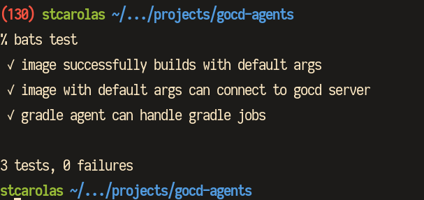
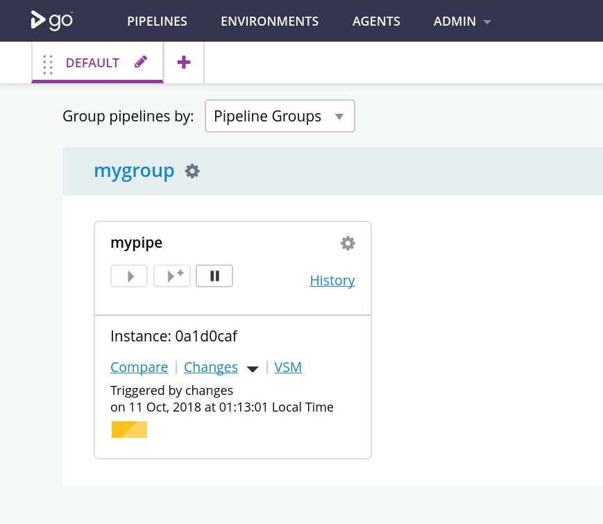

### Как добавить нового агента
1) Добавляем файлик `configs/<имя агента>`. В нем перечисляем названия скриптов, которые надо накатить из `bootstrap.d`
2) запускаем `docker build . -t <name> --build-arg AGENT_TYPE=<имя агента>`

### Запуск тестов
Для запусков тестов нужно установить
- bats-core (`npm install bats-core`) - фреймворк для запуска тестов
- mustache (`gem install mustache`) - шаблонизатор
- jq  

Запускаются тесты командой
```
bats test
```

Для запуска отдельного теста надо указать конкретный файл:
```
bats test/gradle.bats
```

Результат выглядит примерно так:  



### Дебаг тестов
Все важные вещи вынесены в отдельный bash файл, в том числе и команды для полноценного запуска GoCD сервера, подключения к нему config-repo и так далее. Локально можно запустить все, что происходит в тестах, без запуска самих тестов - в таком случае никто не будет гасить контейнеры и можно спокойно позапускать команды и посмотреть на их результат. К примеру, допустим мы хотим посмотреть, как выглядит лог после запуска пайплайна с gradle таской на gradle агенте. В таком случае, находим подходящий тест ("gradle agent can handle gradle jobs"), смотрим на его содержимое:
```
@test "gradle agent can handle gradle jobs" {
    built_agent
    gitserver_is_up
    gocd_is_up
    has_docker_agents_plugin_configured
    has_gradle_agent_profile
    has_config_repo
    sleep 120
    pipeline_status=$(curl --silent http://localhost:8153/go/api/pipelines/mypipe/instance/1 | jq .stages[0].result)
    echo $pipeline_status
    [ "$pipeline_status" == "\"Passed\"" ]
}
```
подцепляем файл со всеми функциями и запускаем все, кроме проверки статуса пайплайна:
```
source test/functions/core.bash
built_agent
gitserver_is_up
gocd_is_up
has_docker_agents_plugin_configured
has_gradle_agent_profile
has_config_repo
```
открываем в браузере http://localhost:8153/go и смотрим, что получилось:  


